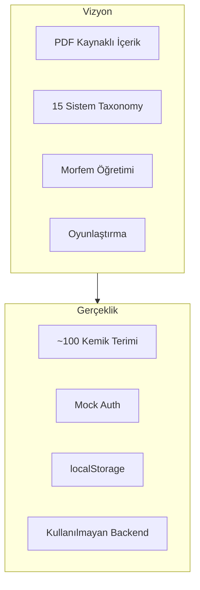
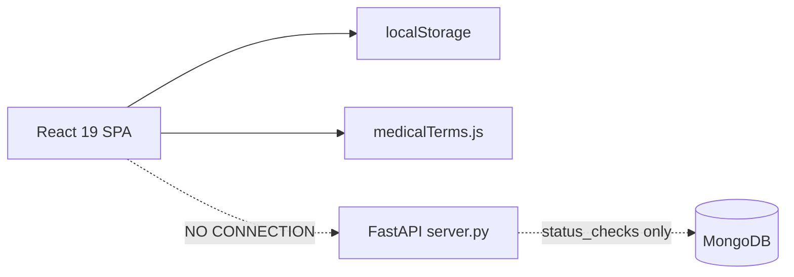

# HealthLexMed — Master Knowledge Extraction & Project DNA Report

**Analiz kaynağı:** Kod tabanı, veri modeli, mimari — canlı site veya görsel durum değil.  
**Tarih:** 11 Haziran 2026  
**Kanıt dosyaları:** [medicalTerms.js](frontend/src/data/medicalTerms.js), [storage.js](frontend/src/utils/storage.js), [App.js](frontend/src/App.js), [server.py](backend/server.py), [Home.jsx](frontend/src/pages/Home.jsx), [MorphemeGame.jsx](frontend/src/pages/MorphemeGame.jsx)

---

## PHASE 1 — PROJECT RECONSTRUCTION

### What is HealthLexMed?

**HealthLexMed**, Türkiye'deki sağlık bilimleri öğrencilerine (tıp, hemşirelik, diğer sağlık programları) yönelik **tıbbi terminoloji öğrenme platformu**dur. Latin anatomik terimleri, İngilizce karşılıkları ve Türkçe klinik tanımları bir arada sunar; flashcard, quiz, eşleştirme ve morfem kurma oyunlarıyla pekiştirmeyi hedefler.

**Kanıt:** [Home.jsx](frontend/src/pages/Home.jsx) L108-110: *"Tıp, hemşirelik ve diğer sağlık bilimleri öğrencileri için interaktif tıbbi terim öğrenme platformu"*

### Product category

| Katman | Kategori |
|--------|----------|
| Birincil | EdTech — Medical Terminology Learning Platform |
| İkincil | Gamified vocabulary trainer |
| Üçüncül | Turkish-localized health sciences study tool |

**VARSAYIM:** Uzun vadede B2C SaaS + kurumsal lisans (üniversite/fakülte) hedefleniyor; kodda monetizasyon yok, bu stratejik niyetten çıkarım.

### Educational problem solved

Türk sağlık öğrencileri anatomi ve klinik derslerde **Latince/İngilizce tıbbi terimleri** ezberlemek zorunda. Ders kitapları ve PDF'ler pasif; Anki/Quizlet genel amaçlı ve Türk müfredatına/domain yapısına uyarlanmamış.

### Unmet need addressed (intended)

1. **Türkçe arayüz + Türkçe klinik tanım** ile çift dilli öğrenme
2. **Morfem/kök-ek ayrıştırma** (`roots` alanı + Morpheme Game) — ezber yerine yapısal anlama
3. **Vücut sistemi bazlı müfredat** (15 sistem, 100+ alt kategori taxonomy)
4. **Oyunlaştırılmış pratik** — sınav stresi altında recall

### What differentiates it from Anki / Quizlet / dictionaries?

**Tasarlanan farklar (henüz tam teslim edilmemiş):**

| Fark | Durum |
|------|-------|
| Türk sağlık müfredatına göre yapılandırılmış içerik (PDF kaynaklı) | Taxonomy var, **içerik %5 dolu** |
| Morfem bazlı terminoloji öğretimi | Kısmi: `roots` string + 19 soruluk ayrı oyun |
| Çok modlu öğrenme (study + 4 oyun) | **Uygulandı** |
| Domain-specific progress/achievements | **Uygulandı** (localStorage) |

**Brutal truth:** Bugün HealthLexMed, Anki'ye karşı **üstünlük kanıtlayamaz**. Anki'de binlerce hazır tıp destesi, SRS, mobil sync, topluluk var. HealthLexMed'in tek somut avantajı şu an: **kemik anatomisi için hazır, Türkçe tanımlı, oyunlaştırılmış mini deneyim** — bu bir niş demo, platform değil.

Quizlet'e karşı: Quizlet daha hızlı içerik oluşturma ve sosyal paylaşım sunar; HealthLexMed'in morfem ve sistem taxonomy'si henüz kullanıcıya hissettirilmiyor (UI sadece 5 kemik kategorisi gösteriyor).

Sözlüklere karşı: HealthLexMed öğrenme döngüsü sunar; sözlük lookup değil. Ama içerik derinliği bir sözlüğün %1'i bile değil.

### Origin signal

Proje **Emergent.sh** scaffold'undan türemiş ([emergent.yml](.emergent/emergent.yml), [index.html](frontend/public/index.html) L25). Bu, hızlı prototip + güçlü UI, zayıf backend entegrasyonu anlamına gelir.



---

## PHASE 2 — PRODUCT DNA

### Core Mission
Sağlık bilimleri öğrencilerinin tıbbi terminolojiyi **anlayarak ve kalıcı olarak** öğrenmesini sağlamak — ezber değil, morfemik ve klinik bağlamlı mastery.

### Core Vision
Türkiye'nin referans **tıbbi terminoloji öğrenme platformu** olmak: PDF/müfredat kaynaklı, AI destekli, adaptif, tüm vücut sistemlerini kapsayan.

### Core Values (çıkarımsal)
- **Erişilebilirlik** — Türkçe arayüz, ücretsiz demo
- **Yapısal öğrenme** — kök-ek ayrıştırma
- **Pratik odaklılık** — oyun ve tekrar
- **İlerleme görünürlüğü** — streak, achievements

### Long-Term Goals
1. 15 vücut sistemi × alt kategoriler = **binlerce terim** corpus
2. Gerçek kullanıcı hesapları ve cross-device sync
3. Sınav hazırlığı (TUS, anatomi sınavları, hemşirelik terminoloji)
4. Kurumsal lisans (fakülte anatomi lab'ları)
5. AI öğrenme koçu ve adaptif zorluk

### Success Criteria
| Metrik | Hedef (VARSAYIM) |
|--------|------------------|
| Aktif öğrenci | 10K+ MAU (Türkiye sağlık öğrencisi pazarı) |
| Retention D7 | >30% |
| Terim mastery | Kullanıcı başına ortalama 200+ terim |
| NPS | >40 |
| Kurumsal | 5+ üniversite pilotu |

### Failure Criteria
- 6 ay sonra hâlâ <500 terim ve mock auth
- Anki destesi olarak kopyalanabilir kalma (fark yok)
- İçerik genişlemesi UI/feature eklemeden geri planda kalma
- Kullanıcı verisi cihazda kaybolması (localStorage) nedeniyle churn

### Competitive Advantages (potansiyel)
1. **Türk sağlık eğitimi odaklı içerik mimarisi** — taxonomy zaten PDF yapısına göre
2. **Morfem-first pedagoji** — Anki/Quizlet'te native değil
3. **Entegre oyun modları** — tek platformda study + 4 oyun
4. **Türkçe klinik tanım katmanı** — uluslararası araçlarda yok

### Competitive Weaknesses (mevcut)
1. **İçerik açlığı** — 100 terim vs. vaat edilen 15 sistem
2. **SRS yok** — öğrenme bilimi eksik
3. **Auth/sync yok** — ciddi ürün değil
4. **Morfem verisi yapılandırılmamış** — `roots` serbest metin, MorphemeGame ayrı veri seti
5. **Mobil native yok** — PWA bile tanımlı değil
6. **Topluluk/UGC yok**

### Market Opportunities
- Türkiye'de ~100K+ sağlık bilimleri öğrencisi (tıp + hemşirelik + diğer)
- Anatomi dersi her yıl tekrarlayan zorunlu ihtiyaç
- Türkçe tıbbi terminoloji için **kaliteli dijital ürün boşluğu**
- Üniversite anatomi hocaları için hazır quiz/flashcard seti
- TUS hazırlık terminoloji modülü (ileri faz)

### Market Threats
- Anki + hazır Türkçe desteler (ücretsiz)
- Quizlet AI Study Sets
- ChatGPT ile anlık terminoloji açıklama (ücretsiz, kişiselleştirilmiş)
- Büyük yayınevlerinin dijital paketleri (Elsevier, Thieme)
- İçerik kopyalama / telif riski (PDF kaynaklı içerik)

---

## PHASE 3 — USER ANALYSIS

### Primary Users: Sağlık Bilimleri Öğrencileri (Lisans 1-3)

| Boyut | Analiz |
|-------|--------|
| **Goals** | Anatomi sınavına hazırlanmak, Latin terimleri hızlı öğrenmek, pratik yapmak |
| **Frustrations** | Ezber yükü, Latince-İngilizce-Türkçe üçlü karmaşa, pasif PDF okuma |
| **Motivations** | Sınav notu, klinik rotasyonlarda hazırlık, akran baskısı |
| **Learning behaviours** | Gece cramming, mobil tekrar, arkadaşlarla quiz, Anki kullanımı yaygın |
| **Willingness to pay** | Düşük-orta; öğrenci bütçesi kısıtlı. **VARSAYIM:** 50-150 TL/ay ancak kanıtlanmış SRS + tam içerik + sınav modu ile |

### Secondary Users: Anatomi / Fizyoloji Öğretim Görevlileri

| Boyut | Analiz |
|-------|--------|
| **Goals** | Öğrencilere pratik kaynağı vermek, quiz hazırlamaktan kurtulmak |
| **Frustrations** | Öğrenci terminoloji zayıflığı, hazır Türkçe dijital kaynak eksikliği |
| **Motivations** | Ders kalitesi, öğrenci başarısı |
| **Willingness to pay** | Kurumsal lisans 5K-50K TL/yıl (VARSAYIM) — ancak ürün olgunlaşmadan satılamaz |

### Potential Future Users

| Segment | Neden |
|---------|-------|
| TUS adayları | Yoğun terminoloji ihtiyacı |
| Yabancı öğrenciler (Türkiye'de tıp) | TR+EN+Latin üçlü |
| Hemşirelik / fizyoterapi | Daha dar ama benzer ihtiyaç |
| Sürekli mesleki gelişim | Uzmanlık terminolojisi |

---

## PHASE 4 — KNOWLEDGE MODEL

### How medical terminology should be taught (pedagogy)

Dünya standartı yaklaşım:

1. **Morfemik analiz** — prefix + root + suffix → anlam üretme
2. **Spaced repetition** — unutma eğrisine göre tekrar
3. **Contextual learning** — anatomik ilişki, klinik örnek
4. **Active recall** — pasif okuma değil, üretim
5. **Interleaving** — karışık sistem/kategori pratiği
6. **Progressive disclosure** — temel → ileri

### How HealthLexMed currently teaches it

```
Term Record:
  term (Latin) → turkish (aslında EN) → roots (serbest metin) → definition (TR)
```

**Modlar:**
- **Study:** Browse + "Öğrendim" toggle (binary mastery)
- **Flashcards:** Recognition recall, 20 terim/session
- **Quiz:** Latin → 4 şıklı MC (İngilizce cevap)
- **Match:** Latin ↔ İngilizce eşleştirme
- **Morpheme:** 19 sabit soru, prefix/root/suffix slot doldurma

**Öğrenme algoritması:** Yok. `saveProgress(termId, boolean)` — SRS, Leitner, SM-2 yok.

### Where current approach is insufficient

| Eksik | Örnek |
|-------|-------|
| `turkish` alanı İngilizce | `Caput Humeri` → `Head of Humerus` (Türkçe değil) |
| `roots` yapılandırılmamış | `"caput (baş) + humerus (kol kemiği)"` parse edilemiyor |
| MorphemeGame izole | `Arthroscopy` sorusu `medicalTerms.js` ile bağlantısız |
| Taxonomy boş | `respiratory`, `nervous` sistemlerde 0 terim |
| Üretim pratiği yok | Kullanıcı terimi yazmıyor, sadece seçiyor |
| Klinik bağlam zayıf | Tanım var ama görsel/anatomik ilişki yok |

### World-class platform would do differently

1. **Structured morpheme graph:** `Arthr/o` → 47 türev terim → ilişkili anatomi
2. **SRS queue:** "Bugün 23 terim tekrarın var" — Anki'nin yaptığı ama domain-specific
3. **Adaptive difficulty:** Zorlandığın morfem ailesine yoğunlaşma
4. **Multimodal:** Kemik terimi + 3D model / diagram hotspot
5. **Exam mode:** Zamanlı, karışık sistem, gerçek sınav formatı
6. **Mastery levels:** Binary değil — new → learning → review → mastered → burned

**Somut örnek:** `Caput Humeri` için world-class:
- Morfem: `caput-` (baş) + `humer-` (üst kol kemiği) + `-i` (çoğul/bağlantı)
- İlişkili: Caput Radii, Caput Femoris (caput ailesi interleaving)
- Görsel: Humerus üzerinde caput işaretli
- SRS: 1 gün → 3 gün → 7 gün tekrar
- Quiz varyantları: Latin→TR, TR→Latin, tanım→terim, morfem→terim

---

## PHASE 5 — CONTENT ANALYSIS

### Content-rich vs feature-rich?

**Şu an: Feature-rich, content-starved.**

UI'da 4 oyun modu, progress dashboard, achievements, streak — ama **~100 terim** (sadece kemik). Taxonomy 15 sistem × onlarca alt kategori vaat ediyor; içerik ~%2-5 dolu.

### Which is more important?

**İçerik.** Neden: Oyun modları commodity; Anki'de plugin ile yapılır. HealthLexMed'in moat'ı **yapılandırılmış, PDF/müfredat uyumlu, Türkçe tanımlı terminoloji corpus'u** olmalı. Feature eklemeden içerik büyütülmezse ürün kopyalanabilir kalır.

### Missing content (priority order)

1. **Hareket sistemi tamamlama** — kas, eklem, yön terimleri (taxonomy'de tanımlı, veri yok)
2. **Solunum, dolaşım, sinir** — temel sistemler (sınavda en çok sorulan)
3. **Prefix/root/suffix kütüphanesi** — `mainCategories` tanımlı, veri yok
4. **Patoloji/semptom terimleri** — `categories.pathology` legacy, boş
5. **Farmakoloji, radyoloji** — ileri faz

### Content that should NEVER be prioritized (early)

- Onkoloji detay corpus (niş, ileri sınıf)
- Genel İngilizce tıbbi terimler (Quizlet'te var)
- Video dersler (farklı ürün kategorisi)
- Sosyal feed / forum (topluluk olmadan değersiz)

### Highest educational value content

| Sıra | İçerik | Neden |
|------|--------|-------|
| 1 | Morfem sözlüğü (prefix/root/suffix) | Bir morfem → yüzlerce terim anlama |
| 2 | Anatomik yön terimleri | Tüm sistemlerin temeli |
| 3 | Hareket sistemi tam (kemik+eklem+kas) | En yoğun sınav konusu |
| 4 | Temel patoloji suffixleri (-itis, -oma, -pathy) | Klinik yıllara köprü |
| 5 | Kardiyovasküler + solunum core | Sistem fizyolojisi öncesi |

---

## PHASE 6 — AI OPPORTUNITIES

### Ranking matrix

| AI Use Case | Rank | Neden |
|-------------|------|-------|
| **AI terminology breakdown** | Must Have | `roots` serbest metin → yapılandırılmış morfem; içerik ölçekleme için kritik |
| **AI content generation (QC'li)** | Must Have | 100→5000 terim manuel sürdürülemez; PDF→structured term pipeline |
| **AI adaptive learning** | High Value | SRS + zayıf alan tespiti; retention için gerekli |
| **AI learning coach** | High Value | "Bu hafta eklem terimlerine odaklan" — engagement |
| **AI exam preparation** | High Value | Sınav formatı quiz üretimi, zayıf konu raporu |
| **AI difficulty prediction** | Nice To Have | Morfem karmaşıklığı + kullanıcı geçmişi ile tahmin |
| **AI chatbot (genel)** | Nice To Have | ChatGPT zaten var; fark yaratmaz |
| **AI görsel/3D üretimi** | Nice To Have | Değerli ama pahalı, içerikten sonra |
| **AI sesli telaffuz** | Nice To Have | Latin telaffuz faydalı, öncelik düşük |
| **AI sosyal özellikler** | Waste Of Time | Erken aşamada distraction |
| **AI ile mock auth yerine "AI login"** | Waste Of Time | Gerçek auth lazım, AI değil |

### Additional opportunities
- **PDF ingestion pipeline:** Mevcut PDF kaynaklarından otomatik term extraction + human review
- **Morfem ilişki grafiği:** AI ile "bu terimle ilişkili 5 terim daha öğren" önerisi
- **Türkçe↔Latin↔EN üçlü çeviri doğrulama** — `turkish` alan adı bug'ını düzeltirken AI QC

---

## PHASE 7 — TECHNICAL DNA

### Current architecture



| Katman | Teknoloji | Durum |
|--------|-----------|-------|
| Frontend | React 19, CRA/CRACO, Tailwind, shadcn/Radix | **Çalışıyor, olgun UI** |
| Routing | react-router-dom v7 | Çalışıyor |
| State | localStorage ([storage.js](frontend/src/utils/storage.js)) | Prototip seviyesi |
| Data | Static JS ([medicalTerms.js](frontend/src/data/medicalTerms.js)) | 355 satır, büyüyor |
| Backend | FastAPI + Motor/MongoDB ([server.py](backend/server.py)) | **Ölü kod** — 3 endpoint, frontend çağırmıyor |
| Auth | Mock ([Auth.jsx](frontend/src/pages/Auth.jsx)) | Üretim için geçersiz |
| Analytics | PostHog (index.html) | Entegre |
| Deploy | Emergent.sh image ref | Minimal config |

### Backend requirements (gerçek ürün için)

1. **User service:** register, login, JWT, bcrypt (deps listede var, kullanılmıyor)
2. **Terms API:** CRUD, search, filter by system/subcategory, pagination
3. **Progress API:** per-term mastery, SRS schedule, session history
4. **Content admin:** PDF import, term review workflow
5. **Analytics events:** server-side learning telemetry

### Database requirements

**MongoDB uygun** (esnek term schema, nested morphemes). Gerekli koleksiyonlar:

- `users`, `terms`, `morphemes`, `user_progress`, `quiz_sessions`, `srs_schedule`
- Indexes: `terms.system`, `terms.subcategory`, `user_progress.userId+termId`

**Alternatif:** PostgreSQL + JSONB — ilişkisel raporlama için daha iyi (kurumsal lisans metrikleri).

### Scalability concerns

| Risk | Şiddet |
|------|--------|
| `medicalTerms.js` bundle bloat (5000+ terim) | Yüksek — code-splitting veya API şart |
| localStorage 5-10MB limit | Yüksek |
| No CDN/static hosting config | Orta |
| Single-file backend | Orta — takım ölçeklenmez |
| No tests | Yüksek — regresyon riski |

### Security concerns

| Risk | Detay |
|------|-------|
| Mock auth | Herkes herhangi email ile "giriş" |
| CORS `*` + credentials | [server.py](backend/server.py) anti-pattern |
| No rate limiting | API expose edilince abuse |
| PDF telif | İçerik kaynağı lisansı belirsiz |
| KVKK | Kullanıcı verisi Türkiye'de; localStorage bile kişisel veri |
| Emergent agent artifacts | [.gitconfig](.gitconfig) repo'da — hijyen sorunu |

### Technical debt (evaluated)

| Borç | Etki | Öncelik |
|------|------|---------|
| Backend-frontend disconnect | Ürün gerçek değil | P0 |
| Mock auth | Güven yok | P0 |
| `turkish` field misnaming | Veri bütünlüğü | P1 |
| MorphemeGame isolated data | Pedagoji kopuk | P1 |
| Taxonomy vs UI mismatch | Kullanıcı güveni | P1 |
| 15+ unused Python deps | Attack surface | P2 |
| No .env.example | Onboarding | P2 |
| No automated tests | Kalite | P2 |
| Deprecated FastAPI shutdown event | Uyumluluk | P3 |

---

## PHASE 8 — PRODUCT ROADMAP

### MVP (0-3 ay) — "Gerçek Ürün Temeli"

**Objective:** Demo'dan **kullanılabilir öğrenme aracı**na geçiş.

| Feature | Business Value | Complexity |
|---------|---------------|------------|
| Gerçek auth (email+şifre, JWT) | Güven, retention | Orta |
| Progress API + sync | Cross-device | Orta |
| Term schema düzeltme (`english`, `turkish`, structured `morphemes[]`) | Veri kalitesi | Düşük |
| Hareket sistemi içerik: 500 terim | Değer önerisi | Yüksek (içerik) |
| Basit SRS (SM-2) | Anki'ye karşı savunma | Orta |
| Morpheme verisini `medicalTerms.js`'e birleştir | Pedagoji bütünlüğü | Orta |

### V2 (3-6 ay) — "İçerik Platformu"

**Objective:** 3 sistem dolu, adaptif öğrenme.

| Feature | Business Value | Complexity |
|---------|---------------|------------|
| Solunum + dolaşım + sinir sistemleri | Sınav kapsamı | Yüksek |
| AI morfem breakdown (batch) | İçerik hızı 10x | Orta |
| Adaptive study plan | Retention +30% | Yüksek |
| Exam mode (zamanlı, karışık) | Sınav hazırlığı | Orta |
| Admin panel (term CRUD) | İçerik operasyonu | Orta |
| PWA / mobil responsive polish | Öğrenci mobil kullanımı | Düşük |

### V3 (6-12 ay) — "AI Coach + Kurumsal"

**Objective:** Monetizasyon ve B2B.

| Feature | Business Value | Complexity |
|---------|---------------|------------|
| AI learning coach | Differentiation | Yüksek |
| Kurumsal lisans (hocanın sınıfına atama) | B2B gelir | Yüksek |
| PDF import pipeline | İçerik ölçekleme | Yüksek |
| TUS terminoloji modülü | Premium segment | Orta |
| Leaderboard / sınıf karşılaştırma | Engagement | Orta |

### V4 (12-18 ay) — "Ekosistem"

**Objective:** Pazar liderliği.

| Feature | Business Value | Complexity |
|---------|---------------|------------|
| 15 sistem tam corpus (5000+ terim) | Moat | Çok yüksek |
| Multimodal (diagram hotspot) | Pedagoji | Yüksek |
| API for LMS integration (Moodle) | Kurumsal ölçek | Yüksek |
| UGC deck sharing (moderated) | Viral büyüme | Yüksek |
| Native mobile app | Retention | Çok yüksek |

---

## PHASE 9 — HARSH REALITY CHECK

### What you are overestimating
- **Oyun modlarının değeri:** 4 oyun modu iyi görünüyor ama 100 terimle 2 günde tüketilir
- **Taxonomy'nin kullanıcıya etkisi:** 15 sistem tanımlı ama kullanıcı 5 kemik kategorisi görüyor — boş vaat
- **"Platform" kimliği:** Şu an bir flashcard demo; platform için auth, sync, içerik, SRS şart
- **Morfem farklılaştırması:** 19 izole soru + serbest metin `roots` — henüz sistematik değil

### What you are underestimating
- **İçerik üretim maliyeti:** 5000 terim × (Latin + EN + TR tanım + morfem + QC) = aylarca iş
- **Anki'nin gücü:** Öğrenciler zaten Anki kullanıyor; "bir tane daha" yeterli değil
- **ChatGPT tehdidi:** "Caput Humeri nedir?" sorusu ücretsiz ve kişiselleştirilmiş
- **Backend borcu:** Frontend güzel ama backend sıfır — bu en büyük teknik risk
- **Telif:** PDF'den extract edilen içerik lisans riski taşır

### Focusing too early
- Achievements / streak gamification (içerik olmadan anlamsız)
- 4 oyun modu çeşitliliği (1-2 mod + SRS yeterli MVP)
- UI polish / shadcn component genişletme
- AI chatbot (önce structured data + SRS)

### Ignoring
- **Spaced repetition** — öğrenme biliminin temeli
- **Veri modeli tutarlılığı** (`turkish` = English bug)
- **Gerçek auth ve veri güvenliği**
- **İçerik operasyon süreci** (kim, nasıl, ne sıklıkla terim ekleyecek?)
- **Go-to-market:** Öğrencilere nasıl ulaşacaksın? (fakülte, Instagram, Anki deck crossover?)

### Top 10 mistakes you could make
1. Feature eklemeye devam edip içerik eklememek
2. Mock auth'u "yeterli" sanmak
3. Anki'yi rakip değil referans almamak (SRS olmadan rekabet imkansız)
4. PDF içeriğini telif kontrolü olmadan yayınlamak
5. MorphemeGame ve medicalTerms'i birleştirmemek
6. Taxonomy UI'da boş kategorileri göstermek (güven kaybı)
7. Backend'i "sonra yaparız" demek — asla yapılmaz
8. ChatGPT'yi rakip görmeden "AI coach" pazarlamak
9. Mobil deneyimi ihmal etmek (öğrenciler telefonda çalışır)
10. Erken monetizasyon (içerik <1000 terimken ücret istemek)

### What would cause failure
- 12 ay sonra hâlâ <300 terim ve localStorage auth
- Öğrenci edinimi stratejisi olmadan "yayınla ve bekle"
- İçerik kalitesi düşük AI-generated terimler (hata = güven kaybı, tıpta ölümcül)
- Kurucu tek başına hem içerik hem kod — burnout

### If I were investing my own money, biggest worry
**"Güzel UI'lı bir Emergent prototipi, henüz ürün-pazar uyumu kanıtlanmamış, içerik derinliği Anki destesinin %1'i, öğrenme bilimi (SRS) yok, backend bağlı değil."** Para ancak şunlar kanıtlanırsa: (1) 500+ kaliteli terim, (2) 100 aktif öğrenci 30 gün retention, (3) "Anki yerine bunu kullanıyorum" feedback'i.

---

## PHASE 10 — HEALTHLEXMED PROJECT MEMORY

> **For future AI systems.** Read this first.

### Identity
- **Name:** HealthLexMed
- **Type:** Turkish medical terminology learning platform (EdTech)
- **Stage:** Early prototype / pre-MVP
- **Origin:** Emergent.sh scaffold (Dec 2025), PDF-extracted content intent
- **Language:** Turkish UI; content is Latin + English + Turkish definitions

### What it IS (today)
A client-side React SPA with ~100 bone anatomy terms, 4 game modes, mock localStorage auth, and no backend integration. Strong UI foundation (shadcn/Tailwind). Taxonomy defines 15 body systems but only movement/bones populated.

### What it WANTS TO BECOME
Turkey's domain-specific medical terminology platform with morpheme-based pedagogy, AI-assisted content scaling, adaptive SRS learning, and institutional licensing.

### Users
- **Primary:** Turkish health sciences students (medicine, nursing)
- **Secondary:** Anatomy instructors (future B2B)
- **Future:** TUS candidates, international students in Turkey

### Architecture snapshot
- Frontend: React 19, CRA/CRACO, react-router-dom, Tailwind, shadcn
- Data: [medicalTerms.js](frontend/src/data/medicalTerms.js) (static), [storage.js](frontend/src/utils/storage.js) (localStorage)
- Backend: [server.py](backend/server.py) — FastAPI + MongoDB, **unused** (only `/api/status`)
- Auth: Mock in [Auth.jsx](frontend/src/pages/Auth.jsx)
- No API calls from frontend; axios in package.json but unused

### Content model
```javascript
{ id, term, turkish/*actually English*/, roots/*free text*/, definition/*Turkish*/, category, system, subcategory }
```
Separate morpheme game data in [MorphemeGame.jsx](frontend/src/pages/MorphemeGame.jsx) (19 questions, not linked).

### Key routes
`/` Home, `/study` browse, `/games` hub, `/flashcards`, `/match`, `/quiz`, `/morpheme` (auth required), `/progress`, `/profile`

### Priorities (in order)
1. Fix data model (`english` vs `turkish`, structured morphemes)
2. Real auth + progress API
3. Content expansion (movement system full → 500 terms)
4. SRS implementation
5. Unify morpheme data with term corpus
6. AI content pipeline (with human QC)
7. Then: more game modes, AI coach, B2B

### Risks
- Content starvation vs feature richness imbalance
- Anki/ChatGPT as free alternatives
- PDF copyright
- Backend never connected
- `turkish` field naming bug causes confusion
- No learning science (SRS)

### Opportunities
- Turkish medical terminology digital gap
- Morpheme-first pedagogy (if executed)
- Structured taxonomy from PDFs (if populated)
- Institutional licensing once content matures

### Do NOT when working on this project
- Judge by current UI visuals — focus on data and pedagogy
- Add features before content
- Assume backend works — it doesn't
- Trust `turkish` field name — it holds English
- Show empty taxonomy categories to users

---

## ACTIONABLE DECISIONS (Somut Kararlar)

| # | Karar | Neden | Hemen yap |
|---|-------|-------|-----------|
| 1 | MVP'yi "auth + SRS + 500 terim" olarak yeniden tanımla | Oyun modu çeşitliliği değil, öğrenme kalıcılığı satılır | Evet |
| 2 | `turkish` → `english` rename + gerçek `turkishDefinition` ekle | Veri bütünlüğü; AI ve UI için temel | Evet |
| 3 | MorphemeGame verisini `medicalTerms.js` morfem sözlüğüne taşı | Pedagoji bütünlüğü | Evet |
| 4 | Backend'i ya bağla ya sil | Ölü kod kafa karıştırır | Evet |
| 5 | Boş taxonomy kategorilerini UI'dan gizle | Güven kaybını önle | Evet |
| 6 | İçerik yol haritası: kemik tamamla → eklem/kas → solunum | Sınav değeri sırası | Planla |
| 7 | Anki export/import desteği ekle | Geçiş maliyetini düşür, rakibi referans al | V2 |
| 8 | AI'ı chatbot değil, morfem extraction + QC pipeline olarak kullan | Ölçeklenebilir içerik | V2 |
